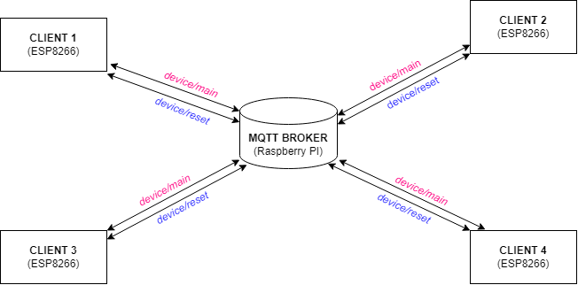

# Wireless Quiz Buzzer System
<center>A wireless quiz buzzer system using Raspberry Pi as game master and ESP8266 as buzzers (slaves).</center>

## System Achitecture


## Components
1. **Raspberry Pi 3B+** — as MQTT broker
1. **Wemos D1 Mini ESP8266MOD** — used in buzzer module
1. **Button Module**
1. **Buzzer**
1. **LEDs**
1. **Jumper Wire**

## Server Setup (Raspberry Pi Setup)
### 1. Make Connections to the Raspberry Board in the Following Manner
*insert image here*
### 2. Create Linux User
1. Create a user with username "*admin*"
****required otherwire all paths in the scripts and commands need to be updated***
### 3. Install Mosquitto MQTT Broker on Raspberry Pi
1. Update your OS
```
sudo apt update && sudo apt upgrade
```
2. Install Package
```
sudo apt-get install mosquitto mosquitto-clients
```
3. To run MQTT broker on startup
```
sudo systemctl enable mosquitto.service
```
4. Check version and installation details
```
mosquitto -v
```
<hr>

### 4. Enable Remote Access
This allows clients from other than local device to publish / subscibe to the MQTT broker.
1. Open configuration file
```
sudo nano /etc/mosquitto/mosquitto.conf
```
2. Paste the following lines in the end
```
listener 1883
allow_anonymous true
```
3. Restart the broker
```
sudo systemctl restart mosquitto
```
4. Check status
```
sudo systemctl status mosquitto
```

<hr>

### 5. Test MQTT Server
1. Subscribe to a topic (from one terminal)
```
mosquitto_sub -d -t "MyTopic"
```
2. Publish message to a topic (from another terminal)
```
mosquitto_pub -d -t "MyTopic" -m "Hello"
```
<hr>

### 5. Download Server Side Scripts
1. Download the scripts in the *RaspberryPi* folder from this repository
2. Paste the scripts in the *Desktop* (without parent folder) ****required otherwire all paths in the scripts and commands need to be updated*** 
<hr>

### 6. Setup Scripts to Run on Startup
Simple setup using crontab to run scripts on startup.
1. Get python interpreter path
```
which python3
```
2. Open system wide crontab
```
sudo crontab -e
```
3. Choose Nano as editor (easiest)
4. Paste the following snippet at the end of the file
```
@reboot <path/to/python-interpreter> /home/admin/Desktop/startup.py

```
5. Make sure to leave an blank line at the end of the file

## Buzzer Module Setup 
### 1. Make Connections to the ESP Board in the Following Manner
*insert image here*
### 2. Upload Code
1. Download the Arduino IDE and install the ESP8266 board manager on it
2. Upload the *client.ino* file in the ESP8266/client folder